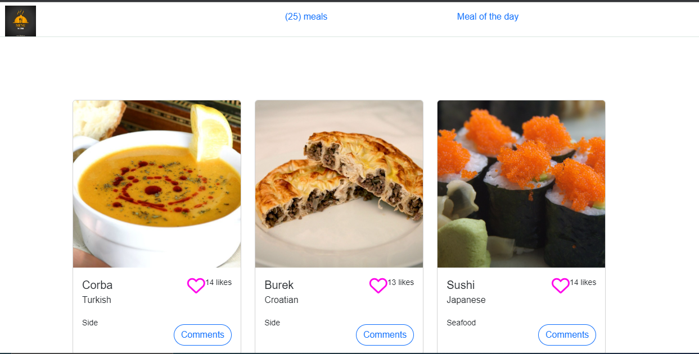
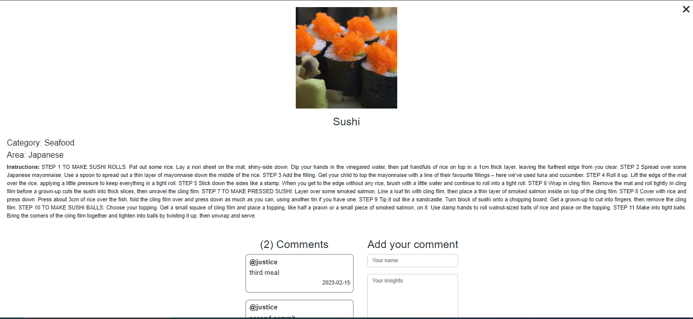

<a name="readme-top"></a>

## Screenshots
### HOMEPAGE


### POPUP DETAILS


<!-- TABLE OF CONTENTS -->

# 📗 Table of Contents

- [📗 Table of Contents](#-table-of-contents)
- [📖 Meal Menu ](#-tv-series-)
  - [🛠 Built With ](#-built-with-)
    - [Tech Stack ](#tech-stack-)
    - [Key Features ](#key-features-)
  - [🚀 Live Demo ](#-live-demo-)
  - [💻 Meal Menu ](#-tv-series--1)
  - [💻 Getting Started ](#-getting-started-)
    - [Prerequisites](#prerequisites)
    - [Setup](#setup)
    - [Install](#install)
    - [Usage](#usage)
    - [Run tests](#run-tests)
    - [Deployment](#deployment)
  - [👥 Authors ](#-authors-)
  - [🔭 Future Features ](#-future-features-)
  - [🤝 Contributing ](#-contributing-)
  - [⭐️ Show your support ](#️-show-your-support-)
  - [🙏 Acknowledgments ](#-acknowledgments-)
  - [📝 License ](#-license-)

<!-- PROJECT DESCRIPTION -->

# 📖 MEAL APP <a name="about-project"></a>

> **MEAL APP** is a JavaScript capstone project for building our own web application based on an external API. We choose a meal API which is an API that provides data about different meals that one can like and add comments and then build the webapp around it. The app has 2  interfaces (One for the home page and the other for showing and adding comments). Users can like their favorite meals and add comment on any meal.

## 🛠 Built With <a name="built-with"></a>

### Tech Stack <a name="tech-stack"></a>

> This project uses the following stack :

<details>
  <summary>Client</summary>
  <ul>
    <li><a href="https://www.w3schools.com/html/">HTML5</a></li>
    <li><a href="https://www.w3schools.com/css/">CSS3</a></li>
     <li><a href="https://www.w3schools.com/js/">JavaScript ES6</a></li>
  </ul>
</details>
<details>
<summary>Server</summary>
  <ul>
    <li><a href="https://webpack.js.org/guides/getting-started/#basic-setup">Webpack Server</a></li>
    <li>APIs
    <ul>
    <li><a href="https://www.themealdb.com/api.php">Meals DB</a></li>
    <li><a href="https://www.notion.so/microverse/Involvement-API-869e60b5ad104603aa6db59e08150270">Involvement API</a></li>
    </ul>
    </li>
  </ul>
</details>

<!-- Features -->

### Key Features <a name="key-features"></a>

> Here are some key features of the application :

- **Display Meals from Meals Db API**
- **Like & comment Meals using Involvement API**

<p align="right">(<a href="#readme-top">back to top</a>)</p>

<!-- LIVE DEMO -->

## 🚀 Live Demo <a name="live-demo"></a>

> Here you can visit my live demo :

- [Live Link](https://fithamlak.github.io/meal-app/dist)

<p align="right">(<a href="#readme-top">back to top</a>)</p>

<!-- LIVE DEMO -->

## 💻 Meals Menu <a name="vgs-presentation"></a>

> Here you can see our presentation :

- [Presentation Video](https://drive.google.com/file/d/1mUMd5lNd_930_lXULDCsyIJrE5O6oy1j/view?usp=sharing)

<p align="right">(<a href="#readme-top">back to top</a>)</p>

<!-- GETTING STARTED -->

## 💻 Getting Started <a name="getting-started"></a>

> Clone the repository by clicking on the 'Code' button and copy the link

To get a local copy up and running, follow these steps.

### Prerequisites

In order to run this project you need:

You should have node install on your local machine
internet connection for api s and bootstrap link

### Setup

Clone this repository to your desired folder:

Example commands:

```sh
  cd my-folder
  git clone https://github.com/fithamlak/meal-app.git
```

-

### Install

Install dependencies :

npm i

### Usage

To run the project, execute the following command:
Open the index.html file in a web browser

### Run tests

To run tests, run the following command:

```sh
  npm test
```

To run the webhint linter

```sh
  npx hint .
```

To run the stylehint linter

```sh
  npx stylehint "**/*.{css,scss}"
```

To run the ESLint linter

```sh
  npx eslint .
```

### Deployment

You can deploy this project using:

```sh
  npm run build
```
```sh
  npm run start
```

<p align="right">(<a href="#readme-top">back to top</a>)</p>

<!-- AUTHORS -->

## 👥 Authors <a name="authors"></a>
👤 **Fithamlak Fikrie**

- GitHub: [@fithamlak](https://github.com/fithamlak)
- LinkedIn:[fithamlak-fikrie](https://www.linkedin.com/in/fithamlak-fikrie-942169225/)

👤 **Nshanji Hilary Ndzi**

- GitHub: [@dazehinn](https://github.com/dazehinn)
- LinkedIn: [nshanji-hilary-ndzi](https://www.linkedin.com/in/nshanji-hilary-ndzi-b3b8a1256/)

<p align="right">(<a href="#readme-top">back to top</a>)</p>

<!-- FUTURE FEATURES -->

## 🔭 Future Features <a name="future-features"></a>

- **Reservation for Meals**

<p align="right">(<a href="#readme-top">back to top</a>)</p>

<!-- CONTRIBUTING -->

## 🤝 Contributing <a name="contributing"></a>

Contributions, issues, and feature requests are welcome!

Feel free to check the [issues page](../../issues/).

<p align="right">(<a href="#readme-top">back to top</a>)</p>

<!-- SUPPORT -->

## ⭐️ Show your support <a name="support"></a>

If you like this project star it!

<p align="right">(<a href="#readme-top">back to top</a>)</p>

<!-- ACKNOWLEDGEMENTS -->

## 🙏 Acknowledgments <a name="acknowledgements"></a>

I would like to thank the Microverse team.

<p align="right">(<a href="#readme-top">back to top</a>)</p>
<!-- LICENSE -->

## 📝 License <a name="license"></a>

This project is [licensed](./LICENSE) .

<p align="right">(<a href="#readme-top">back to top</a>)</p>
